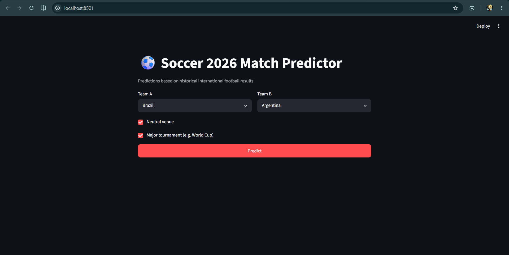
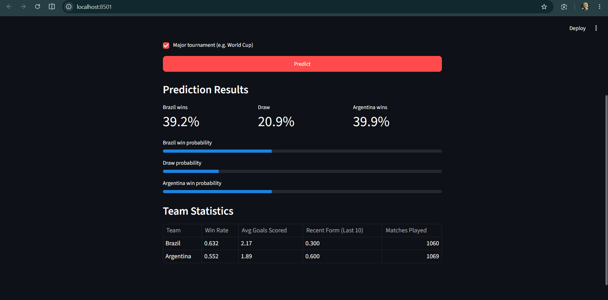

# ⚽ IBM World Cup Predictor

An AI-powered football match prediction application built using Python, Machine Learning, Streamlit, and IBM Bob as part of the IBM SkillsBuild AI Builders Challenge.

## 📌 Overview

This project predicts the outcome of international football matches using historical match data and machine learning techniques.

The model analyzes team performance statistics such as:

- Win rate
- Average goals scored
- Recent form
- Tournament type
- Neutral venue status

and predicts whether:

- Team A Wins
- Match Ends in a Draw
- Team B Wins

## 🎯 Project Objectives

- Explore historical football match data
- Perform feature engineering
- Train and evaluate a machine learning model
- Build an interactive prediction interface
- Learn AI-assisted software development using IBM Bob

## 🛠 Technologies Used

- Python
- Pandas
- Scikit-learn
- Streamlit
- Joblib
- Requests
- Jupyter Notebook
- IBM Bob

## 📂 Project Structure

```
IBM-WorldCup-Lab/
│
├── 00_intro/
├── 01_get-started_with_bob/
├── 02_main_lab_instructions/
├── 03_jupyter_notebook/
├── 04_data/
├── 05_images/
├── data/
├── models/
│   └── team_data
│
├── app.py
├── bob_generated_code.ipynb
├── requirements.txt
├── README.md
├── home-page.png
└── prediction-results.png
```

## 📊 Dataset

This project uses the International Football Results dataset containing over 49,000 international matches from 1872 to 2026.

Dataset source:

https://github.com/IBM-SkillsBuild-AI-Builders-Challenge/hands-on-labs

## 🚀 Features

- Historical football data analysis
- Automated feature engineering
- Match outcome prediction
- Interactive Streamlit user interface
- Team statistics comparison
- Probability-based predictions

## 🧠 Machine Learning Workflow

### Task 1
Install required Python libraries

### Task 2
Download and load the dataset

### Task 3
Explore historical football data

### Task 4
Engineer predictive features

### Task 5
Split data into training and test sets

### Task 6
Train and evaluate the model

### Task 7
Save model artifacts

### Task 8
Test model predictions

### Task 9
Build a Streamlit application

### Task 10
Launch the application

## 📸 Screenshots

### Home Page



### Prediction Results



## ▶️ How to Run

### Install dependencies

```bash
pip install -r requirements.txt
```

### Run the application

```bash
streamlit run app.py
```

### Open in browser

```text
http://localhost:8501
```

## ⚠️ Note

The trained model file (`match_predictor`) is not included in this repository because it exceeds GitHub's web upload size limit.

To recreate the model:

1. Open `bob_generated_code.ipynb`
2. Run Tasks 1–8 sequentially
3. The model will be generated automatically

## 🏆 IBM SkillsBuild AI Builders Challenge

This project was developed as part of the IBM SkillsBuild AI Builders Challenge to gain hands-on experience with:

- AI-assisted software development
- Data science workflows
- Machine learning
- Real-world problem solving

## 👨‍💻 Author

**Ravi**

B.Tech CSE (AI) Student

IBM SkillsBuild AI Builders Challenge Participant

## 📜 License

This project is intended for educational and learning purposes.